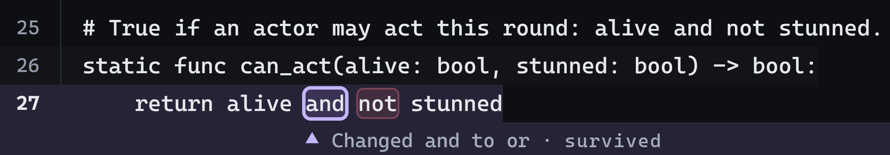
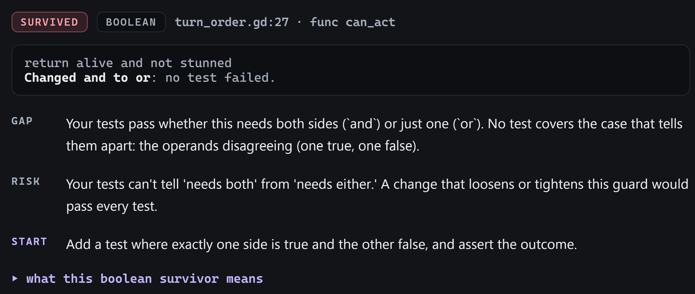

<h1 align="center">
  
</h1>

<p align="center"><strong>Mutation testing for GDScript and Godot: find the bugs your green tests would miss.</strong></p>

<p align="center">
  <a href="https://github.com/kphutt/gdmutant/actions/workflows/ci.yml"></a>
  <a href="https://pypi.org/project/gdmutant/"></a>
  <a href="#compatibility"></a>
  <a href="https://github.com/bitwes/Gut"></a>
  <a href="https://github.com/godot-gdunit-labs/gdUnit4"></a>
  <a href="https://www.python.org/downloads/"></a>
  <a href="https://github.com/kphutt/gdmutant/blob/main/LICENSE"></a>
</p>

<p align="center"><sub>A community tool, not affiliated with or endorsed by the Godot Foundation.</sub></p>

## What it is

Coverage tells you a line *ran*. Mutations tell you if a bug there would be *caught*: a killed
mutant means yes, a survivor means no. A standalone CLI, no AI required.

Same idea, other languages: [mutmut](https://github.com/boxed/mutmut) for Python, [Stryker](https://stryker-mutator.io/) for JS/TS, [PIT](https://pitest.org/) for Java.

gdmutant mutates your GDScript (flips `>`↔`>=`, `and`↔`or`, bumps a number, deletes a statement),
reruns your tests once per change, and reports the survivors.

The `--html` report, open on `turn_order.gd`. A survivor in the source, `and` marked on line 27:

<p align="center">
  
</p>

and its detail card: what it means, why it's risky, and how to close it.

<p align="center">
  
</p>

## Prerequisites

- [Godot](https://godotengine.org/) 4.3+ (see [Compatibility](#compatibility) for exact versions),
  on your PATH so a plain `godot --version` works, or pass `--godot <full-path>` on every gdmutant
  command instead.
- [GUT](https://github.com/bitwes/Gut) or [gdUnit4](https://github.com/godot-gdunit-labs/gdUnit4),
  already installed and enabled in your project, if you use either. A different test runner works
  too, via `--runner command` (any headless command that exits non-zero on failure) or
  `--runner godot-command` (the same, but Godot-aware — see the [CLI
  guide](docs/gdmutant-guide.md#runner-selection)).
- [Python](https://www.python.org/downloads/) 3.12+ (check with `python --version`).

## Quickstart

This mutates `corpus/`, a small real Godot project bundled in this repo just for this: a real
script and a real GUT/gdUnit4 suite to try gdmutant against before pointing it at your own.

```sh
git clone https://github.com/kphutt/gdmutant

cd gdmutant                                # corpus/ lives right here, at the repo root

pip install .                              # installs gdmutant and its own dependencies

python scripts/install_gdunit4.py          # gdUnit4 is a Godot addon that isn't vendored in git; this fetches it

gdmutant run corpus/turn_order.gd --project corpus --runner gdunit4 --html
# mutates one file, reruns corpus/'s real GdUnit4 tests against each mutant
```

Output:

```
...

  corpus\turn_order.gd:27   func can_act

     27 |     return alive and not stunned
        |                  ^  changed  and  to  or: every test still passed

  gap    Your tests pass whether this needs both sides (`and`) or just one
         (`or`). No test covers the case that tells them apart: the
         operands disagreeing (one true, one false).

  risk   Your tests can't tell 'needs both' from 'needs either.' A change
         that loosens or tightens this guard would pass every test.

  start  Add a test where exactly one side is true and the other false,
         and assert the outcome.

  more   https://github.com/kphutt/gdmutant/blob/main/docs/survivors/README.md#boolean
──────────────────────────────────────────────────────────────────────────

Results

Mutation score: 61.1%
  killed:   11
  timeout:  0  (counted as killed)
  survived: 7
  ignored:  0  (suppressed, excluded from score)
  invalid:  0
  error:    0

Wrote HTML report to gdmutant-report-turn_order-<timestamp>.html. Open it in a browser.
```

## Point it at your own project

```sh
pip install 'gdmutant==0.1.*'   # gdmutant is 0.x: pin the minor so a new one is a move you make on purpose
```

Pick your test runner with `--runner` (required). [GUT](https://github.com/bitwes/Gut) or
[gdUnit4](https://github.com/godot-gdunit-labs/gdUnit4) — Godot has no built-in test runner, so both
ship as addons: a plugin folder (`addons/gut/` or `addons/gdUnit4/`) that lives inside a Godot
project. Whichever you pick needs to already be installed there, in the project you're pointing
gdmutant at. Godot itself needs to be on PATH, or point at it with `--godot <path>`.
gdUnit4's usual test layout matches gdmutant's default `--tests res://test`, so a gdUnit4 command
needs no `--tests` flag. GUT needs it spelled out: its stock layout puts suites in `test/unit/`
instead, and GUT's own `-gdir` doesn't search subdirectories.

```sh
# GUT
gdmutant run ../my-project/src/module.gd --project ../my-project --runner gut --tests res://test/unit --json
```

```sh
# gdUnit4
gdmutant run ../my-project/src/module.gd --project ../my-project --runner gdunit4 --json
```

`--json` follows the
[`mutation-testing-elements`](https://github.com/stryker-mutator/mutation-testing-elements) schema

See the [survivor reference](docs/survivors/README.md) for what
`ignored`, `invalid` and `error` mean.

## Killing Survivors

Kill each survivor with a real test, or mark a genuine equivalent with `# gdmutant: ignore` and a
reason ([details](docs/survivors/README.md)). Re-run until nothing survives. A mutation score
isn't a target to hit, it's a direction to watch. There's no universal "good" number.

## Compatibility

| | Verified at every release | Expected to work |
|---|---|---|
| Godot | 4.7.0 | 4.3+ |
| Runner | GUT 9.7.1, gdUnit4 6.1.3 | GUT 9.x, gdUnit4 6.x, any headless command |

## Documentation

- [Survivor reference](docs/survivors/README.md): every operator explained, the score formula, how to kill or justify each.
- [Design & architecture](docs/design/DESIGN.md): the engine and the "Saboteur & the Jury" design.
- [The gdmutant guide](docs/gdmutant-guide.md): the CLI, troubleshooting, and the GitHub Action, in one place.
- [Contributing](CONTRIBUTING.md) · [Changelog](CHANGELOG.md) · [Credits](docs/credits.md)

## License

[MIT](LICENSE), © 2026 kphutt.
