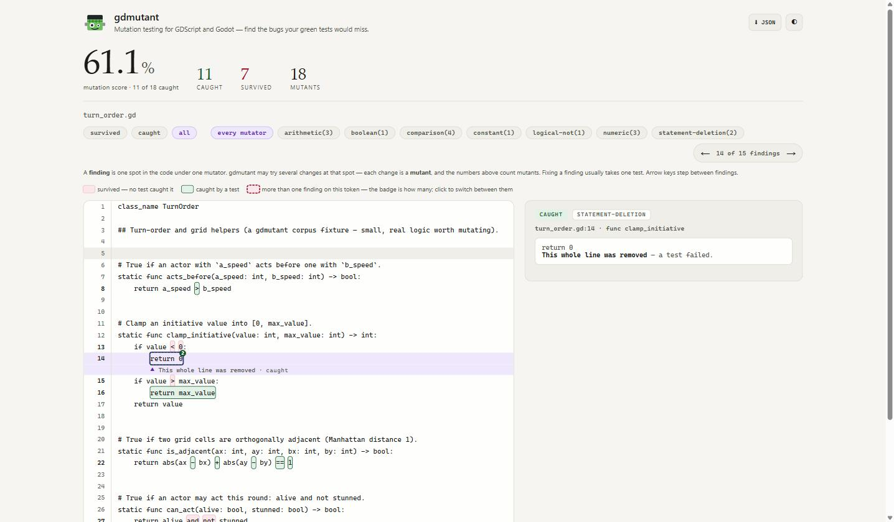

<h1 align="center">
  
</h1>

<p align="center"><strong>Mutation testing for GDScript and Godot: find the bugs your green tests would miss.</strong></p>

<p align="center">
  <a href="https://github.com/kphutt/gdmutant/actions/workflows/ci.yml"></a>
  <a href="https://pypi.org/project/gdmutant/"></a>
  <a href="#compatibility"></a>
  <a href="https://github.com/bitwes/Gut"></a>
  <a href="https://github.com/godot-gdunit-labs/gdUnit4"></a>
  <a href="https://www.python.org/downloads/"></a>
  <a href="https://github.com/kphutt/gdmutant/blob/main/LICENSE"></a>
</p>

<p align="center"><sub>A community tool, not affiliated with or endorsed by the Godot Foundation.</sub></p>

## What it is

gdmutant mutates your GDScript (flips `>`↔`>=`, `and`↔`or`, bumps a number, deletes a statement),
reruns your tests once per change, and reports the survivors: lines a bug could live on that no
test catches. Here's a real one:

```
Mutation score: 61.1%

──── survived ─────────────────────────────────────────────── boolean ────

  corpus\turn_order.gd:27   func can_act

     27 |     return alive and not stunned
        |                  ^  changed  and  to  or — every test still passed

  gap    Your tests pass whether this needs both sides (`and`) or just one
         (`or`). No test covers the case that tells them apart: the
         operands disagreeing (one true, one false).

  risk   Your tests can't tell 'needs both' from 'needs either.' A change
         that loosens or tightens this guard would pass every test.

  start  Add a test where exactly one side is true and the other false,
         and assert the outcome.

  more   https://github.com/kphutt/gdmutant/blob/main/docs/survivors/README.md#boolean
──────────────────────────────────────────────────────────────────────────
```

Coverage tells you a line *ran*. Mutations tell you if a bug there would be *caught*: a killed
mutant means yes, a survivor means no. Those are not the same question, and the more code
a project ships (whoever or whatever wrote it), the more of it rides on the answer. A standalone
CLI, no AI required.

Same idea, other languages: [mutmut](https://github.com/boxed/mutmut) for Python,
[Stryker](https://stryker-mutator.io/) for JS/TS, [PIT](https://pitest.org/) for Java.

## Is this for you?

- You write GDScript and test with GUT, gdUnit4, or any `godot --headless` command.
- You already have a Godot project whose tests pass, however you run them. gdmutant grades those
  tests, it doesn't replace them.
  No project yet? See it find a real bug first, using gdmutant's own test fixture. No project
  required.

## Prerequisites

- [Godot](https://godotengine.org/) 4.3+ (see [Compatibility](#compatibility) for exact versions).
- The GUT or gdUnit4 addon, already installed and enabled in your project, if you use either.
- Python 3.12+. If you don't have it, don't go install it yourself: get
  [uv](https://docs.astral.sh/uv/) instead, which fetches its own.

  ```sh
  # Windows (PowerShell)
  powershell -ExecutionPolicy ByPass -c "irm https://astral.sh/uv/install.ps1 | iex"

  # macOS / Linux
  curl -LsSf https://astral.sh/uv/install.sh | sh
  ```

## Compatibility

| | Verified at every release | Expected to work |
|---|---|---|
| Godot | 4.7.0 | 4.3+ |
| Runner | GUT 9.7.1, gdUnit4 6.1.3 | GUT 9.x, gdUnit4 6.x, any headless command |

gdmutant is `0.x`, so anything can change between minor versions: flags, exit codes, console output.
Pin `gdmutant==0.1.*` in CI so a new minor is a version you move to on purpose, and take a `1.0` as
the point where the CLI surface and exit codes stop moving.

## Quickstart

### See it find a real bug, right now

```sh
git clone https://github.com/kphutt/gdmutant
cd gdmutant
uv sync --frozen                           # installs gdmutant's own pinned dependencies
uv run python scripts/install_gdunit4.py   # the addon isn't vendored in git; this fetches it
uv run gdmutant run corpus/turn_order.gd --project corpus --html report.html
# mutates one file, reruns corpus/'s real GdUnit4 tests against each mutant, writes report.html
```

~30 seconds on a cold checkout, most of it Godot's one-time project import. The console prints
each survivor as it's found, the same explanation shown at the top of this page: what's
untested, why it matters, where to start a test. No report file is needed to see it. `--html`
writes that same explanation to `report.html` too: one self-contained file to open, keep, or send
someone, with every survivor on its own source line and the same `61.1%` shown at the top of this
page. This is `report.html` from the run above, on `return 0`, where two different mutants (a
numeric change and a whole-line deletion) land on the same token: the badge shows how many, and
clicking it switches between them.

<p align="center">
  
</p>

### Point it at your own project

Make gdmutant a small uv project in a folder beside your Godot project, never inside it: `uv init`
drops `.git`, `.gitignore`, `.python-version`, `pyproject.toml`, a `README.md` of its own and a
starter Python file wherever you run it, and none of that belongs in your project's own
repository. Which starter file depends on your uv version, `main.py` at the root through 0.11 and
`src/<name>/__init__.py` from 0.12, so treat the list as the shape of the mess rather than an
exact manifest. Pin the interpreter: `uv init` alone floors on whatever it finds, and gdmutant
needs 3.12+.

```sh
uv init --python 3.12 gdmutant-workspace
cd gdmutant-workspace
uv add gdmutant
```

Already have Python 3.12+ yourself? `pip install gdmutant` works just as well: drop the `uv run`
prefix from every command below.

A real run reruns your tests once per mutant and reports the survivors: lines where a bug could
live that no test catches. Finding those is what the tool is for.

Pick your runner. [GUT](https://github.com/bitwes/Gut) and
[gdUnit4](https://github.com/godot-gdunit-labs/gdUnit4) are peer JUnit-XML readers (gdUnit4 is the
default). Both need their addon already installed and Godot itself on PATH, or `--godot <path>`.
The exit-code runner further down needs neither. `--tests` names the one directory holding your
suites. It defaults to `res://test`, but GUT's stock layout is `test/unit/` and GUT's `-gdir` does
not search subdirectories:

```sh
# GUT
uv run gdmutant run ../my-project/src/module.gd --project ../my-project \
  --runner gut --tests res://test/unit --json report.json

# gdUnit4 (the default)
uv run gdmutant run ../my-project/src/module.gd --project ../my-project --json report.json
```

`--json` writes the
[`mutation-testing-elements`](https://github.com/stryker-mutator/mutation-testing-elements) schema,
for feeding a dashboard.

No JUnit XML? Point the exit-code runner at any headless command that exits non-zero on failure.
`--godot <path>` only applies to the GUT/gdUnit4 runners above. Under `--runner command`,
gdmutant runs your `--command` string exactly as given and never edits it, so if `godot` isn't on
your PATH, write its full path directly into the command yourself:

```sh
uv run gdmutant run ../my-project/src/module.gd --project ../my-project \
  --runner command --command "godot --headless --script res://tests/run_tests.gd" --json report.json
```

Mutation score isn't a target, it's a direction. There's no universal "good" number. Watch
it trend as you kill survivors. See the [survivor reference](docs/survivors/README.md) for what
`ignored`, `invalid` and `error` mean.

## The workflow

1. Pick a target. Start with the file you trust least: new code, thin tests, or core logic
   (state machines, scoring, boundaries). One file at a time. A whole directory's survivor list is
   too much to work through at once.
2. Run it (see Quickstart above).
3. Kill or annotate every survivor. Each block's `start` line says where to add a test. A
   proven equivalent (one that truly can't change behavior) gets `# gdmutant: ignore` plus a
   reason on that line instead ([details](docs/survivors/README.md)).
4. Re-run to confirm, then move on: done with a file at zero `survived`. No third state,
   so the loop always ends.

gdmutant boots Godot once per mutant, so time scales with mutant count. It tells you
what the run is before it starts, keeps you posted while it goes, and prints the wall-clock when it
finishes. But it never predicts a finish time, because it cannot do that honestly (see
[Troubleshooting](#troubleshooting)). `--jobs N` runs N at once. The run below passed
`--timeout 30`. Left alone, gdmutant caps each mutant at ten times the baseline suite, with a
floor of 10s and a ceiling of 600s:

```
18 mutants to run. Baseline suite 1.4s; each mutant is capped at 30s.
… 7/18 done in 1m 12s — 2 survived, 1 timed out.
Done in 6m 32s — 18 mutants, 8 timed out (4m 0s of that). Baseline suite 1.4s.
```

The heartbeat lands every 30s on a terminal, and less often in a log or in CI. `--progress plain`
forces the quieter cadence. `--progress none` turns the whole progress stream off: heartbeat, plan
line, closing line, the line each mutant prints as it finishes, and the `preparing the project` /
`running the unmutated (baseline) suite` notices too, so a slow first run says nothing at all until
it is done. Use `auto` or `plain` if you want that signal. The summary and the report are
unaffected either way.

## Configuration

Persist per-project defaults in `.gdmutant.toml` (anything you pass on the command line wins):

```toml
project = "."
runner = "command"
# command and godot need --trust-config, see below
command = "godot --headless --script res://tests/run_tests.gd"
# godot = "/Applications/Godot.app/Contents/MacOS/Godot"
# exclude = ["*_generated.gd", "*/vendor/*"]
```

Two of those keys (`command` and `godot`) name a program gdmutant will run. gdmutant reads
`.gdmutant.toml` from the directory you are in, so in a project you cloned that file was written
by somebody else. It therefore refuses to act on those two keys unless you say the file is
trustworthy:

```
gdmutant run scripts --trust-config
```

Without `--trust-config`, gdmutant names the offending keys, exits 2, and runs nothing. It only
refuses when the file actually decides the program. A value that matches gdmutant's default, or
that you also passed as a flag, decides nothing. Passing `--command`/`--godot` yourself always
needs no trust. Every other key is just a setting, never a program to run.

## Troubleshooting

- `pip` or `python` isn't recognized, or `python` opens the Microsoft Store. You have no Python.
  Install uv (see [Prerequisites](#prerequisites)). It brings its own.
- "GUT found no tests …" on the baseline run. Nothing is broken: `--tests` defaults to
  `res://test`, GUT's layout puts suites in `test/unit/`, and `-gdir` doesn't search
  subdirectories. Pass `--tests res://test/unit`. For a *tree* of suites, run GUT yourself with
  `-ginclude_subdirs` behind `--runner command`.
- "GUT ran 0 tests" partway through a run. That one is real: a mutant broke a test file badly
  enough that GUT skipped its suite and ran the rest green. Reported as an error, not a survivor.
- The addon isn't found. GUT or gdUnit4 must already be installed and enabled in the project
  `--project` names. gdmutant installs neither.
- `godot` isn't on PATH. Pass `--godot <full-path>`. It has no effect inside `--command`. Put
  the full path in that string yourself.
- Everything survives. Usually the tests never ran: run your suite by hand first. Godot exits `0`
  even on a harness that fails to *compile*, so gate a `--command` harness on `can_instantiate()`.
- It's slow. Godot boots once per mutant. Mutate one file at a time, and use `--jobs N`, real
  but sub-linear (~3× at `--jobs 4`), since the workers contend for CPU and RAM. Watch the closing
  line for how much of the time was timeouts. A few hanging mutants can outweigh every other
  mutant combined, and `--timeout` caps each one.
- How long will it take? Up front it tells you what the run *is*: how many mutants, and the cap
  on each, so you know how long silence is normal. A rate estimate was built and measured before
  being dropped: on an even workload it tracked the true finish to within 5%, but on a run whose
  hanging mutants arrived late it read 3.2s at 25% done for a run that took 58s. A mutant that
  hangs costs its whole timeout, and nothing before it hints that it will.
- The first run goes quiet for minutes right after it starts. gdmutant does warn you first (the
  GUT/gdUnit4 runners print a "preparing the project" notice, and `--runner command` warns too
  when the project has no `.godot/` directory), but the wait itself is silent: that's Godot
  importing every asset in the project, once, which gdmutant can't see into or report on. Run
  `godot --headless --path <project> --import` yourself first so every later run starts in
  seconds.
- Want to see what gdmutant would touch before committing to a full run? `--dry-run` lists the
  mutants without running your tests: a scoping check on a large file, or before wiring up
  `--exclude`, not a substitute for a real run (it can't tell you anything your tests would catch).
  `gdmutant example` writes a small bundled file if you want to see the shape of the output first:
  `gdmutant example && gdmutant run gdmutant-hello-world.gd --dry-run`.
- Most survivors are on `assert` lines. Expected, and not noise you have to fix: a failed `assert`
  kills the Godot process, so no in-process test can catch a weakened one. gdmutant explains each
  one and counts them under the survivor list rather than hiding them
  ([the full story](docs/survivors/README.md#assert)).

## Is it safe to run against my real files?

Yes, by construction, not by promise. See [Design & architecture](docs/design/DESIGN.md) for how
the mutate/run/restore loop itself is built. In a serial run gdmutant edits your source file where
it lies, then restores its exact original bytes after every mutant and on exit, including Ctrl-C.
Under `--jobs N` with N above 1 each worker mutates its own copy of the project, so your own file
is never touched. Every write goes to a temporary file beside the source and is then renamed over
it, so the path always holds one whole file or the other, never half of each.

Two things can still leave the mutant sitting on disk. A hard kill (a crash, a power loss) stops
the restore before it can run, and if it lands between the temporary write and the rename it also
leaves a stray `.<name>.<random>.tmp` beside your source, which is safe to delete. And a write
that cannot finish at all (a full disk, or an antivirus or editor lock that outlasts the retries)
ends the run with an error rather than retrying unsafely, which leaves the mutant where your
original was. That one needs no crash. Either way, put the file back from git.

Commit or stash first, or pass `--require-clean`, which refuses to start unless git already holds
a committed copy of every file it is about to mutate. That is stricter than a clean tree: a
project not in git, a file git ignores, and git not being installed all fail it too, because none
of them leave a copy to put back.

## GitHub Action

gdmutant ships as a GitHub Action too, so a workflow can run it with no Python, Godot or gdmutant
install step:

```yaml
- uses: kphutt/gdmutant@REPLACE_WITH_THE_RELEASE_COMMIT_SHA  # v0.1.0
  with:
    godot-version: "4.7.0"   # the only required input
    project-path: ./
    tests: res://test/unit
```

Pin that commit SHA, or a full `vX.Y.Z` tag. There is no `@v1` or `@v0`. Every published tag
names a full version and never moves, so a floating major tag is not something this repo can
produce. Bumps come from Dependabot instead, as PRs you review before taking. Full input
reference, the `since`/`fetch-depth` requirement, and what the step writes to the job summary:
[docs/github-action.md](docs/github-action.md).

## Documentation

- [Survivor reference](docs/survivors/README.md): every operator explained, the score formula, how to kill or justify each.
- [Design & architecture](docs/design/DESIGN.md): the engine and the "Saboteur & the Jury" design.
- [The GitHub Action](docs/github-action.md): full input reference.
- [Driving gdmutant from an AI agent](docs/using-with-an-ai-agent.md): invocation, JSON schema, the loop for a script.
- [Contributing](CONTRIBUTING.md) · [Changelog](CHANGELOG.md) · [Credits](docs/credits.md)

## License

[MIT](LICENSE), © 2026 kphutt.
