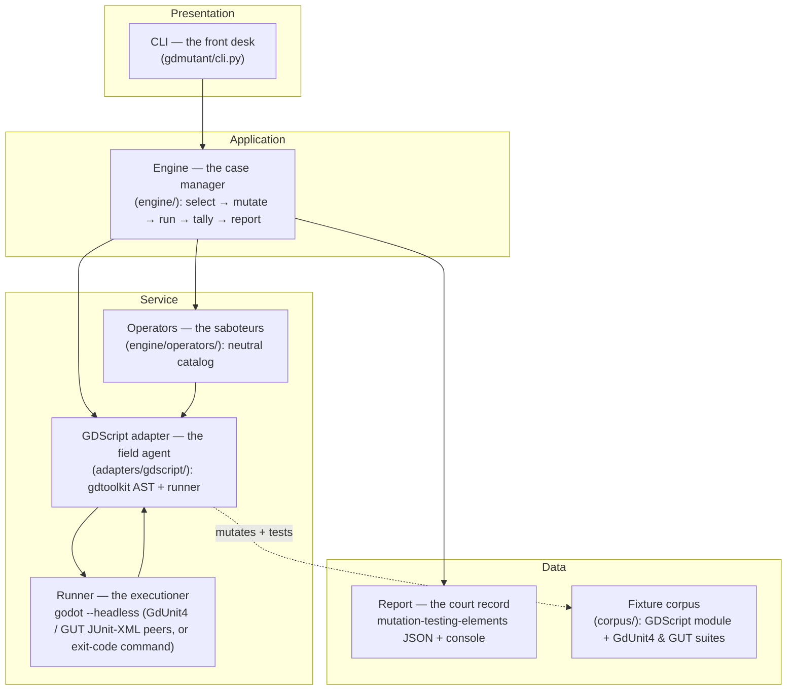

# gdmutant: Design & Architecture

The authoritative design for gdmutant's v0.1: a language-agnostic mutation-testing engine with a
GDScript adapter. It defines *what* v0.1 must do (functional requirements), *how well* (non-functional
requirements), and the *shape* of the code that delivers it. Product rationale is in
[`README.md`](../../README.md). The stack decision is [`docs/decisions/0001`](../decisions/0001-write-the-engine-in-python-not-gdscript.md).

Scope note: this document covers v0.1, the deterministic operator core + the GDScript adapter, run
against a bundled fixture. Some work the plan first deferred has since shipped (the HTML report,
the `--since` incremental/diff-scoped mode, and `--jobs` parallel evaluation). §5 marks what landed.
Work still deferred (coverage-gated mutant selection, the LLM-semantic mode, further language
adapters) is named in §5, not designed here.

---

## 1. Goals

Mutation testing answers the question coverage can't: *coverage says a line ran. Mutation says a bug
on that line would be caught.* gdmutant mutates a project's source, reruns its tests per mutant, and
reports survivors, the mutants no test killed. Three goals shape every decision below:

- G-1: Ship a real v0.1 fast. A working tool that mutates one real GDScript module and prints its
  survivors beats a perfect framework. Depth on one language over breadth.
- G-2: Standalone, no AI required. A normal CLI a developer installs and runs.
  Usable from the README alone. AI is never a dependency.
- G-3: Generic engine, per-language adapters. The loop (mutate → run → tally → report) is
  language-neutral. Only two things are language-specific: mutating the AST and running the tests. Build
  the loop once, and a new language is one small adapter.

---

## 2. Functional Requirements (what the system must do)

### FG-1: Mutant generation
- FG-1.1: Given a GDScript source file, the system shall parse it, apply each applicable operator to
  each applicable AST node, and produce one mutant per (node, operator, replacement). An operator
  may offer more than one replacement for a node (e.g. a numeric-literal bump yields `n+1` and `n-1`).
- FG-1.2: Each mutant is a single, isolated change (one operator at one site), never two at once, so a
  survivor points at exactly one line.
- FG-1.3: The system shall record each mutant's identity: file, line/column span, operator id, and the
  original → mutated text.

### FG-2: Operator catalog (language-neutral)
- FG-2.1: The catalog shall include, at minimum:
  - boolean (`and`↔`or`)
  - comparison (`>`↔`>=`, `<`↔`<=`, `==`↔`!=`)
  - arithmetic (`+`↔`-`, `*`↔`/`)
  - constant (e.g. `true`↔`false`, bump an int literal)
  - statement deletion (replace a whole statement with `pass`)

  The first four are token swaps and live in the language-neutral catalog. Statement deletion does
  not. It rewrites a whole statement instead of swapping one token, and deciding which statements are
  safe to delete needs the language's own rules, so it lives in the GDScript adapter
  ([ADR-0007](../decisions/0007-statement-deletion-with-a-return-path-guard.md)). It refuses to delete
  a typed function's return unless a later return still guarantees a value, because Godot rejects a
  typed function that can fall off its end. That is a real dent in G-3: a second language adapter has
  to reimplement statement deletion rather than inherit it.
- FG-2.2: An operator declares *what* it matches and *how* it rewrites, with no language specifics. The
  adapter maps operators onto a concrete language's AST nodes.

### FG-3: Test execution per mutant
- FG-3.1: For each mutant, the system shall run the target project's test suite against a tree in which
  only that mutant is applied, and capture the pass/fail outcome.
- FG-3.2: For the GDScript adapter, execution runs the project's tests headless via the pluggable
  Runner seam, a runner-agnostic adapter contract ([ADR-0011](../decisions/0011-runner-agnostic-adapter-seam.md)):
  the engine knows only the contract, never a framework. Two peer JUnit adapters ship
  first-class, GdUnit4 and GUT (both run via `godot --headless` and parse JUnit-XML for
  per-test detail, and neither is privileged), plus the framework-neutral exit-code command runner
  ([ADR-0005](../decisions/0005-exit-code-test-runner-convention.md)) as the fallback for any harness
  without JUnit output (a hand-rolled `SceneTree` runner, a bespoke CLI). Every runner upholds the
  crash-safety clause: a load/compile crash surfaces as a kill or error, never a silent zero-test
  pass. GdUnit4 upholds it via the "report must reappear" guard, the command runner via its exit code.
  GUT needs more. It skips a suite that fails to compile, runs the remaining ones green and exits 0,
  so the report still carries the healthy files' passes and the test count is not zero. What catches
  that case is a drop below the healthy baseline's test count, which a live probe proved necessary. A
  `tests == 0` guard covers only the narrower shape where the whole run collects nothing. Any future
  JUnit-emitting framework is first-class by adding one small adapter, with no engine change.

  The seam is three protocols, not one. `Runner` is the required one: run the suite once, report the
  aggregate result. `Preparable` is optional and covers a slow one-time setup. The engine calls
  `prepare` before it starts timing the baseline, so setup cost never inflates the per-mutant timeout
  derived from that baseline. Both Godot runners implement it, because each needs a cold-checkout
  import scan before its framework's command-line tool will load. `RunWarning` is optional too and
  lets a runner raise a single run-level warning once the whole pass ends, which never changes the
  mutation score or the exit code. The engine tests for the optional two by type, so it never names
  what the setup or the warning actually is and stays language-neutral (NF-3).
- FG-3.3: The original (unmutated) suite must pass first. If it doesn't, the run aborts with a clear
  error (mutation testing a red suite is meaningless).

### FG-4: Verdict tally
- FG-4.1: Each mutant is classified as one of:
  - killed (a test failed)
  - survived (all tests passed)
  - timeout (the mutation hung the suite, a detection counted as killed, Stryker's `Timeout` status)
  - ignored (a `# gdmutant: ignore` annotation suppresses it, so it is generated for the report but
    never run, Stryker's `Ignored` status, see
    [ADR-0004](../decisions/0004-equivalent-mutant-ignore-annotation.md) and
    [ADR-0006](../decisions/0006-operator-scoped-ignore-and-ignored-status.md))
  - invalid (the mutant didn't parse, per NF-5)
  - error (the runner failed to execute it, e.g. a crash)

  Ignored, invalid and error mutants are excluded from the score. There is no separate no-coverage
  verdict: v0.1 gathers no coverage data, so a mutant on a line no test exercises is classified
  *survived*, which is where no-coverage folds until coverage-gated selection exists.
- FG-4.2: The system shall compute the mutation score = (killed + timeout) /
  (killed + timeout + survived), and totals. Timeouts count as detected (Stryker convention).

### FG-5: Reporting
- FG-5.1: The system shall emit a report in the
  [`mutation-testing-elements`](https://github.com/stryker-mutator/mutation-testing-elements) JSON schema,
  so it renders in the existing HTML viewer for that schema.
- FG-5.2: The system shall print a concise console summary: score, counts per verdict, and each
  survivor's `file:line` + operator.

### FG-6: CLI
- FG-6.1: A standalone `gdmutant` command runs a full mutation pass over a configured set of source
  files against the project's tests, with no AI involved.
- FG-6.2: It exits non-zero on operational failure (e.g. FG-3.3 abort), not on surviving mutants.
  Survivors are report output, not a pass/fail gate: mutation results are advisory (report-mode),
  complementary to coverage. A project decides what to do with them.

---

## 3. Non-Functional Requirements (how the system must be)

- NF-1: Deterministic & reproducible. The operator core is fully deterministic: same inputs → same
  mutants → same verdicts. This is what lets a report be trusted and diffed over time. (Any future
  LLM-semantic mode is nondeterministic and stays out of this core.)
- NF-2: Standalone / no AI. No runtime dependency on any AI service. The core prerequisites are
  *Godot (already installed by a Godot dev) + the gdmutant CLI*, installed from PyPI with `pip`,
  `pipx` or `uv` (see the README). Two things sit just outside that core. The JUnit runners need the
  project's test-framework addon present, which any project already using GdUnit4 or GUT has, and
  `--since` and `--require-clean` call git, so they need git on the path and the file in a repo.
- NF-3: Engine ⊥ adapter decoupling. `engine/` contains no GDScript-specific assumptions. Everything
  language-specific lives in `adapters/<lang>/`. A new language must not require touching the engine.

  The requirement scopes structure, not wording. Nothing under `engine/` imports the adapter,
  gdtoolkit or lark, and the GDScript adapter reaches the engine only as an injected `Adapter` value.
  A few user-facing strings the engine prints do name GDScript and Godot: the HTML report's tagline,
  the markdown report's code fence, and the survivor explanations. Those are copy. No engine logic
  branches on them, and a second language adapter would restate them rather than fight them.
- NF-4: Language-neutral operators. The operator catalog is expressed against an abstract notion of
  nodes/tokens. Adapters bind operators to a real AST.
- NF-5: Mutant validity. The adapter must never hand the runner un-parseable source. A mutation that
  would produce invalid GDScript is detected (re-parse check) and classified `invalid` (→ `CompileError`
  in the report), never counted as `killed`. A wrong mutant means a silently wrong survivor report,
  the worst failure.

  Oracle boundary: the validity check is gdtoolkit's parser, not Godot itself. A
  mutant gdtoolkit accepts but Godot rejects at load fails toward score-*inflation* (the suite errors →
  `error`, or writes no report → `error` via the runner's freshness guard), never toward a false
  survivor. The live self-test (`tests/test_selftest_live.py`) bounds this for the corpus: it boots
  all 18 gdtoolkit-accepted mutants (16 token swaps plus 2 statement deletions) into real Godot and
  asserts zero `RuntimeError` outcomes, so for that mutant set, gdtoolkit and Godot's parsers are
  confirmed to agree (a Godot-rejected mutant would surface as `error`, failing the assertion). A
  dedicated `godot --check-only` parse-agreement probe over arbitrary mutants is a fast-follow.

  Generation-time exclusions: the re-parse check is only the second half of the validity story, and
  it cannot see the first. gdtoolkit's grammar carries no type information, so it accepts source
  Godot later rejects. The GDScript adapter therefore refuses to generate four shapes at all: a `%`
  that formats a string, a `+` that joins strings, a `+=` that appends to one, and a property
  initializer whose stored value can never be read back. GDScript's `String` defines no `-`, so each
  of the first three would yield a mutant Godot rejects rather than one a test could disagree with.
  The fourth is inert by language rule: GDScript does not run a property's setter on the initializer
  in its own declaration, so when a custom getter means nothing ever reads the backing field again,
  no change to that initializer can alter behavior. FG-2.1's return-path guard on statement deletion
  is the same policy applied to a whole statement. An excluded mutant is never generated, so it never
  reaches the denominator, and the score reads higher than a run that emitted it. That is the honest
  direction, because the excluded shapes are broken or inert mutants rather than gaps a test could
  have closed, but it does mean a score is not comparable across a version that added an exclusion.
- NF-6: Performance headroom. v0.1 runs the full suite per mutant (simple, correct). Booting Godot
  per mutant is slow, so the design leaves clean seams for two speedups. Both have since shipped:
  `--jobs N` evaluates mutants in parallel, each on its own copy of the project, and `--since
  <ref>` mutates only the lines a diff changed. The remaining, still-deferred lever is
  coverage-gated selection (only run tests that cover the mutated line), which the seam preserves
  without reshaping the engine.
- NF-7: Safe source writes. Every write to a source file either lands whole or does not happen at
  all. gdmutant rewrites the user's own file twice per mutant (§4), and a plain in-place write empties
  the file before putting anything back, so a crash inside that window would destroy the file instead
  of leaving a readable mutant on it. Instead the new text goes to a temporary file in the target's
  own directory, is flushed all the way to the disk, and is then moved onto the target with a rename,
  which is a single filesystem operation. Staying inside one directory is what keeps it single: across
  a filesystem boundary the move would degrade into a copy, the very non-atomic write being avoided. A
  symbolic link is resolved first, so the real file is the one rewritten rather than the link
  replaced, and a file the user marked read-only is refused rather than quietly replaced. There is no
  degraded path. Anything that stops the staged write, a full disk or a lock that never clears, raises
  an error with the target exactly as it was. A fallback that wrote in place would already have
  emptied the file by the time its own write failed, which is the outcome this requirement exists to
  prevent.

---

## 4. Architecture: "The Saboteur & the Jury"

A mutant is a saboteur who makes one small, deliberate change to the code. The project's tests are the
jury that should catch it. gdmutant runs the trial for every saboteur and records who got away.
Separation of concerns is the spine: the engine knows the *procedure*, the adapter knows the *language*.

| Component | Role ("the …") | Responsibility |
|---|---|---|
| `cli.py` | Front desk | Parse args, load config, invoke the engine, print the summary, set the exit code. |
| `engine/` | Case manager | Orchestrate the loop: enumerate targets, drive operators + adapter, collect verdicts, hand off to the reporter. Language-neutral. |
| `engine/operators/` | The saboteurs | The neutral operator catalog: *what* to change, expressed abstractly. |
| `adapters/gdscript/` | The field agent | Parse GDScript (gdtoolkit), apply an operator at a node, re-emit valid source (NF-5), invoke the runner, translate its output to a verdict. |
| runner (in adapter) | The executioner | `godot --headless` + GdUnit4 or GUT (peer JUnit-XML adapters over one contract), or the exit-code command runner. Return pass/fail. |
| tally (in engine) | The jury foreman | Classify each mutant (FG-4) and compute the score. |
| reporter (in engine) | The court record | Emit the `mutation-testing-elements` JSON + the console summary (FG-5). |

### Where a mutant is applied

gdmutant mutates the project's real source files in place. For each mutant the engine writes the
mutated text over the file itself, runs the suite against it, and writes the original back in a
`finally` ([ADR-0003](../decisions/0003-mutation-application-strategy.md)). The suite loads code from
disk through `res://`, so there is nowhere else to put a mutant the tests would actually see. The
engine restores the file whenever it is still running to do so, but a process killed outright cannot
restore anything, so a hard kill can leave a mutant on disk. This is why gdmutant warns when git holds
no copy of a file it is about to mutate, and why `--require-clean` refuses to start without one. NF-7
governs how each individual write survives that risk.

Under `--jobs N` this changes. Each worker gets its own copy of the whole project and mutates the file
inside that copy, so workers can never collide on one file and the real source is never written to on
that path.

### Mutation mechanism: the one open design question

Whether the adapter re-emits by *unparsing the
gdtoolkit tree* or by *precise AST-guided source-span edits* is settled by a short spike at the start of
implementation (fidelity: does a round-trip preserve formatting/comments?). NF-5's re-parse guard makes
either choice safe. This is the only piece deliberately left for the spike. Everything else above is fixed.

Settled by [ADR-0002](../decisions/0002-mutation-mechanism-source-span-editing.md), which chose
AST-guided source-span editing. The spike found that gdtoolkit offers no way to unparse an arbitrary
mutated tree, and that its formatter reflows whole files, which would bury a survivor's diff in
unrelated reformatting. The tree only locates the token span, and the engine replaces exactly that
span in the original text, so everything around the mutation stays as the author wrote it. The
question is kept as written above because this document records the design as it stood.

---

## 5. Build plan

### Tier A: the minimal runnable milestone (v0.1)

All five shipped.

1. Adapter spike: decide the mutation mechanism (unparse vs. source-span), prove a single `>`→`>=` mutant
   round-trips to valid GDScript.
2. Operator catalog (FG-2) + engine loop (select → mutate → run → tally → report), full-suite-per-mutant.
3. GDScript adapter (FG-1/FG-3) + the NF-5 validity guard.
4. Bundled `corpus/` (a small GDScript module + GdUnit4 and GUT suites) that doubles as gdmutant's own
   regression tests. Prove the tool mutates it and prints real survivors, identically under both
   JUnit adapters.
5. `mutation-testing-elements` JSON + console reporter (FG-5).

### Tier B: designed for but not built in v0.1

Since shipped: the HTML report (`--html`), the
incremental/diff-scoped mode (`--since`), and parallel evaluation (`--jobs`). Still deferred:
coverage-gated mutant selection (the NF-6 seam), the optional LLM-semantic mutant mode, and additional
language adapters.
