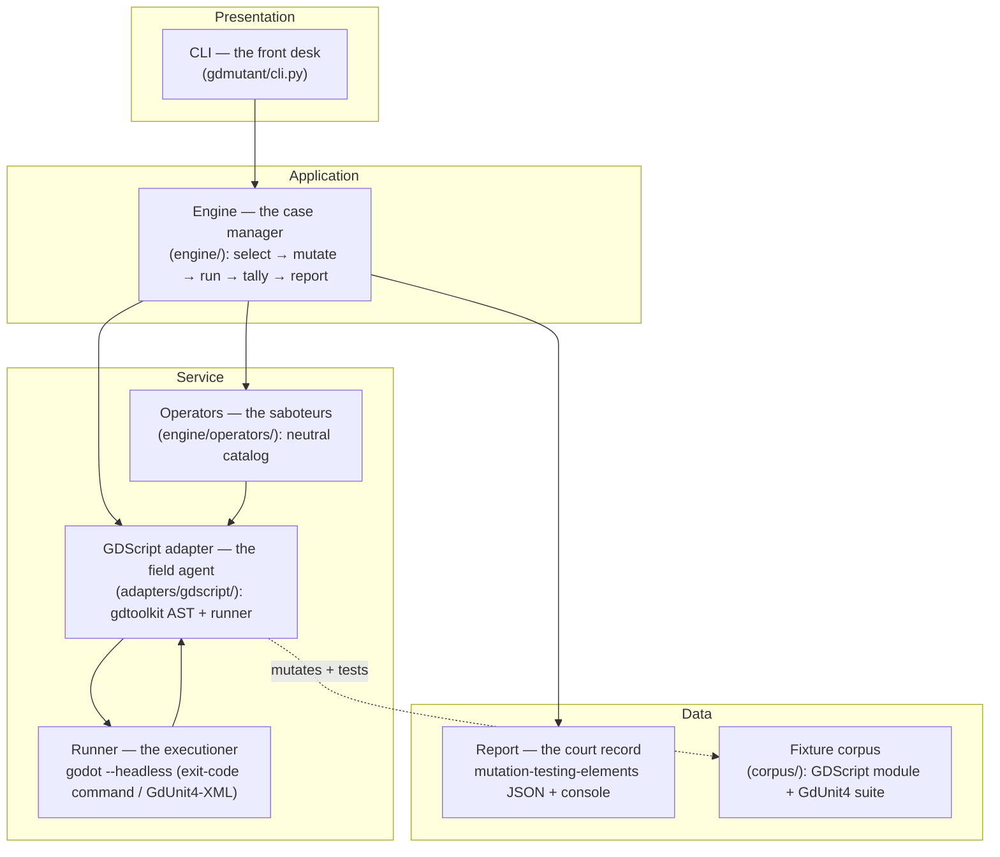

# gdmutant — Design & Architecture

The authoritative design for gdmutant's v0.1: a language-agnostic mutation-testing engine with a
GDScript adapter. It defines *what* v0.1 must do (functional requirements), *how well* (non-functional
requirements), and the *shape* of the code that delivers it. Product rationale is in
[`README.md`](../../README.md); the stack decision is [`docs/decisions/0001`](../decisions/0001-write-the-engine-in-python-not-gdscript.md).

Scope note: this document covers **v0.1 — the deterministic operator core + the GDScript adapter, run
against a bundled fixture**. Deferred work (coverage-gating, HTML report, incremental mode, the
LLM-semantic mode, further language adapters) is named in §5, not designed here.

---

## 1. Goals

Mutation testing answers the question coverage can't: *coverage says a line **ran**; mutation says a bug
on that line would be **caught**.* gdmutant mutates a project's source, reruns its tests per mutant, and
reports **survivors** — mutants no test killed. Three goals shape every decision below:

- **G-1 — Ship a real v0.1 fast.** A working tool that mutates one real GDScript module and prints its
  survivors beats a perfect framework. Depth on one language over breadth.
- **G-2 — Standalone, no AI required.** A normal CLI a developer installs and runs, exactly like Stryker.
  Usable from the README alone; AI is never a dependency.
- **G-3 — Generic engine, per-language adapters.** The loop (mutate → run → tally → report) is
  language-neutral; only two things are language-specific — mutating the AST and running the tests. Build
  the loop once; a new language is one small adapter.

---

## 2. Functional Requirements (what the system must do)

### FG-1 — Mutant generation
- **FG-1.1** Given a GDScript source file, the system shall parse it, apply each applicable operator to
  each applicable AST node, and produce one **mutant** per (node, operator, replacement) — an operator
  may offer more than one replacement for a node (e.g. a numeric-literal bump yields `n+1` and `n-1`).
- **FG-1.2** Each mutant is a single, isolated change (one operator at one site) — never two at once, so a
  survivor points at exactly one line.
- **FG-1.3** The system shall record each mutant's identity: file, line/column span, operator id, and the
  original → mutated text.

### FG-2 — Operator catalog (language-neutral)
- **FG-2.1** The catalog shall include, at minimum: **boolean** (`and`↔`or`), **comparison**
  (`>`↔`>=`, `<`↔`<=`, `==`↔`!=`), **arithmetic** (`+`↔`-`, `*`↔`/`), **constant** (e.g. `true`↔`false`,
  bump an int literal), and **statement deletion** (drop a `return`/call).
- **FG-2.2** An operator declares *what* it matches and *how* it rewrites, with no language specifics; the
  adapter maps operators onto a concrete language's AST nodes.

### FG-3 — Test execution per mutant
- **FG-3.1** For each mutant, the system shall run the target project's test suite against a tree in which
  only that mutant is applied, and capture the pass/fail outcome.
- **FG-3.2** For the GDScript adapter, execution runs the project's tests headless via the pluggable
  **Runner** seam. Two ship: the general **exit-code command runner** (any `godot --headless` command
  that exits non-zero on failure — GUT, GdUnit4's CLI, or a hand-rolled `SceneTree` harness;
  [ADR-0005](../decisions/0005-exit-code-test-runner-convention.md)) is the universal path; a
  dedicated **GdUnit4 runner** parses GdUnit4's machine-readable (JUnit-XML)
  output for finer per-test detail.
- **FG-3.3** The original (unmutated) suite must pass first; if it doesn't, the run aborts with a clear
  error (mutation testing a red suite is meaningless).

### FG-4 — Verdict tally
- **FG-4.1** Each mutant is classified: **killed** (a test failed), **survived** (all tests passed),
  **timeout** (the mutation hung the suite — a detection, counted as killed, Stryker's `Timeout`
  status), **no-coverage** (no test exercised the line — v0.1 folds this into *survived* until
  coverage exists), **invalid** (the mutant didn't parse — NF-5), or **error** (the runner failed to
  execute it, e.g. a crash). Invalid and error mutants are excluded from the score.
- **FG-4.2** The system shall compute the **mutation score** = (killed + timeout) /
  (killed + timeout + survived), and totals. Timeouts count as detected (Stryker convention).

### FG-5 — Reporting
- **FG-5.1** The system shall emit a report in Stryker's
  [`mutation-testing-elements`](https://github.com/stryker-mutator/mutation-testing-elements) JSON schema,
  so it renders in that ecosystem's existing HTML viewer.
- **FG-5.2** The system shall print a concise console summary: score, counts per verdict, and each
  survivor's `file:line` + operator.

### FG-6 — CLI
- **FG-6.1** A standalone `gdmutant` command runs a full mutation pass over a configured set of source
  files against the project's tests, with no AI involved.
- **FG-6.2** It exits non-zero on operational failure (e.g. FG-3.3 abort), **not** on surviving mutants.
  Survivors are report output, not a pass/fail gate: mutation results are **advisory** (report-mode),
  complementary to coverage — a project decides what to do with them.

---

## 3. Non-Functional Requirements (how the system must be)

- **NF-1 — Deterministic & reproducible.** The operator core is fully deterministic: same inputs → same
  mutants → same verdicts. This is what lets a report be trusted and diffed over time. (Any future
  LLM-semantic mode is nondeterministic and stays out of this core.)
- **NF-2 — Standalone / no AI.** No runtime dependency on any AI service. Prerequisites are exactly
  *Godot (already installed by a Godot dev) + `pipx install gdmutant`*.
- **NF-3 — Engine ⊥ adapter decoupling.** `engine/` contains no GDScript-specific assumptions; everything
  language-specific lives in `adapters/<lang>/`. A new language must not require touching the engine.
- **NF-4 — Language-neutral operators.** The operator catalog is expressed against an abstract notion of
  nodes/tokens; adapters bind operators to a real AST.
- **NF-5 — Mutant validity.** The adapter must never hand the runner un-parseable source. A mutation that
  would produce invalid GDScript is detected (re-parse check) and classified `invalid` (→ `CompileError`
  in the report), never counted as `killed`. A wrong mutant means a silently wrong survivor report — the
  worst failure. **Oracle boundary:** the validity check is gdtoolkit's parser, not Godot itself — a
  mutant gdtoolkit accepts but Godot rejects at load fails toward score-*inflation* (the suite errors →
  `error`, or writes no report → `error` via the runner's freshness guard), never toward a false
  survivor. The live self-test (`tests/test_selftest_live.py`) bounds this for the corpus: it boots
  all 16 gdtoolkit-accepted mutants into real Godot and asserts **zero `RuntimeError`** outcomes — so
  for that mutant set, gdtoolkit and Godot's parsers are confirmed to agree (a Godot-rejected mutant
  would surface as `error`, failing the assertion). A dedicated `godot --check-only` parse-agreement
  probe over arbitrary mutants is a fast-follow.
- **NF-6 — Performance headroom.** v0.1 runs the full suite per mutant (simple, correct). Booting Godot
  per mutant is slow, so the design must leave a clean seam for the deferred **coverage-gated selection**
  (only run tests that cover the mutated line) without reshaping the engine.

---

## 4. Architecture — "The Saboteur & the Jury"

A mutant is a **saboteur** who makes one small, deliberate change to the code; the project's tests are the
**jury** that should catch it. gdmutant runs the trial for every saboteur and records who got away.
Separation of concerns is the spine: the engine knows the *procedure*, the adapter knows the *language*.

| Component | Role ("the …") | Responsibility |
|---|---|---|
| `cli.py` | Front desk | Parse args, load config, invoke the engine, print the summary, set the exit code. |
| `engine/` | Case manager | Orchestrate the loop: enumerate targets, drive operators + adapter, collect verdicts, hand off to the reporter. Language-neutral. |
| `engine/operators/` | The saboteurs | The neutral operator catalog — *what* to change, expressed abstractly. |
| `adapters/gdscript/` | The field agent | Parse GDScript (gdtoolkit), apply an operator at a node, re-emit valid source (NF-5), invoke the runner, translate its output to a verdict. |
| runner (in adapter) | The executioner | `godot --headless` + GdUnit4; return pass/fail from the JUnit-XML. |
| tally (in engine) | The jury foreman | Classify each mutant (FG-4) and compute the score. |
| reporter (in engine) | The court record | Emit the `mutation-testing-elements` JSON + the console summary (FG-5). |

**Mutation mechanism — the one open design question.** Whether the adapter re-emits by *unparsing the
gdtoolkit tree* or by *precise AST-guided source-span edits* is settled by a short spike at the start of
implementation (fidelity: does a round-trip preserve formatting/comments?). NF-5's re-parse guard makes
either choice safe. This is the only piece deliberately left for the spike; everything else above is fixed.

---

## 5. Build plan

**Tier A — the minimal runnable milestone (v0.1):**
1. Adapter spike: decide the mutation mechanism (unparse vs. source-span), prove a single `>`→`>=` mutant
   round-trips to valid GDScript.
2. Operator catalog (FG-2) + engine loop (select → mutate → run → tally → report), full-suite-per-mutant.
3. GDScript adapter (FG-1/FG-3) + the NF-5 validity guard.
4. Bundled `corpus/` (a small GDScript module + a GdUnit4 suite) that doubles as gdmutant's own regression
   tests; prove the tool mutates it and prints real survivors.
5. `mutation-testing-elements` JSON + console reporter (FG-5).

**Tier B — deferred, designed for but not built in v0.1:**
Coverage-gated mutant selection (NF-6 seam), the HTML report, incremental/diff-scoped mode, the optional
LLM-semantic mutant mode, and additional language adapters.
